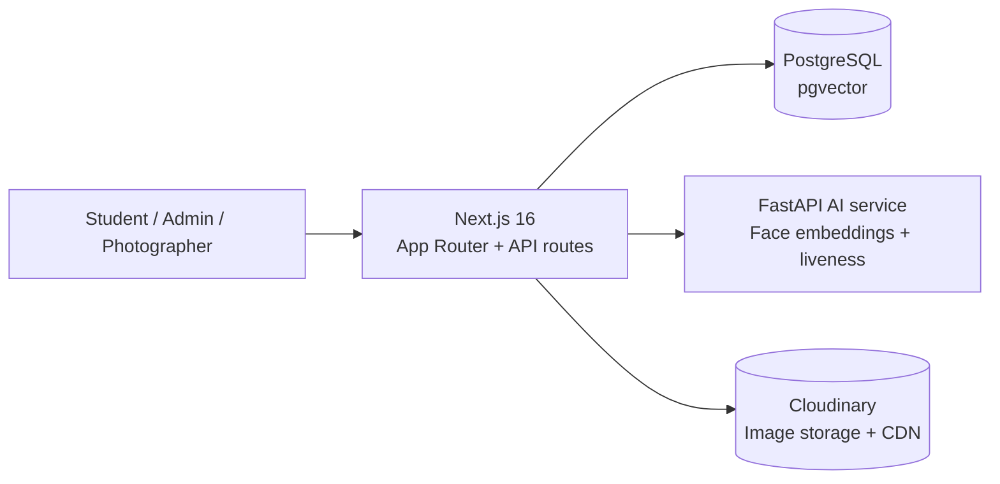

# PhotoFinder

> AI-powered photo discovery for campus events.

PhotoFinder helps students find photos of themselves across event albums using face search. It combines a Next.js application, a PostgreSQL database with `pgvector`, Cloudinary image delivery, and a dedicated Python AI service for face processing.

<p align="center">
  <a href="#quick-start">🚀 Quick start</a> ·
  <a href="#architecture">🏗️ Architecture</a> ·
  <a href="#documentation">📚 Documentation</a>
</p>

## 🚀 Features

- **Instant Face Search:** Upload a selfie to find photos of yourself across event albums.
- **Auto-Match:** Set a default "reference face." The system finds and notifies you of matches from past and future events.
- **Privacy-First:** Mandatory PDPA consent flow. Students can delete their biometric data at any time.
- **Consent Intelligence:** Soft warning when withdrawing consent, one-click privacy data export, and one-click full privacy delete with live deletion status.
- **Admin Dashboard:** Manage events, users, and photo removal requests. Includes real-time system health metrics.
- **Photographer Portal:** Bulk upload high-resolution event photos to Cloudinary.
- **Photographer Analytics Dashboard:** Track event-level photo views, downloads, and engagement rates.

## Architecture



The repository is organized around two deployable applications:

| Component | Location | Responsibility |
| --- | --- | --- |
| Web application | [`photofinder-nextjs/`](./photofinder-nextjs/) | UI, authentication, API routes, business logic, and Prisma access |
| AI service | [`ai-service/`](./ai-service/) | Face detection, embedding extraction, liveness, and image processing |
| Local infrastructure | [`docker-compose.yml`](./docker-compose.yml) | PostgreSQL with `pgvector`, AI service, and the web container |

## Tech stack

### Core Stack

- **Framework:** [Next.js 16](https://nextjs.org/) (App Router)
- **Language:** TypeScript
- **Styling:** Tailwind CSS & [shadcn/ui](https://ui.shadcn.com/)
- **Authentication:** Custom JWT via Google Workspace OAuth

### Infrastructure & Services

- **Database:** PostgreSQL hosted on [Neon](https://neon.tech/)
- **ORM:** [Prisma](https://www.prisma.io/)
- **Vector Search:** `pgvector` PostgreSQL extension (for storing and querying AI facial embeddings)
- **Image Storage:** [Cloudinary](https://cloudinary.com/) (optimized storage and delivery)
- **AI Microservice:** A separate Python/FastAPI service hosted on Hugging Face Spaces that processes images and returns 512-dimensional facial embeddings.

## Quick start

### Prerequisites

- Node.js 18 or newer
- npm
- Docker Desktop with Compose
- Google OAuth credentials
- Cloudinary credentials

### 1. Configure environment variables

From the repository root:

```bash
cp .env.example .env
```

At minimum, set these values in `.env`:

```dotenv
CLOUDINARY_URL="cloudinary://..."
NEXT_PUBLIC_GOOGLE_CLIENT_ID="..."
GOOGLE_CLIENT_ID="..."
GOOGLE_CLIENT_SECRET="..."
SUPER_ADMIN_EMAIL="you@example.com"
```

The local database, AI service URL, application URL, and development secrets already have local defaults. See [`.env.example`](./.env.example) for the complete reference. Never commit `.env` or real credentials.

### 2. Install web dependencies

```bash
cd photofinder-nextjs
npm install
```

### 3. Start the local stack

For a complete containerized environment:

```bash
cd ..
docker compose up --build -d
```

For the faster hot-reload workflow, run the infrastructure containers first:

```bash
# From the repository root
docker compose up postgres ai-service -d

# In a second terminal
cd photofinder-nextjs
npm run dev
```

Open [http://localhost:3000](http://localhost:3000) when the services are ready. The local PostgreSQL database is exposed on port `5432`, and the AI service is exposed on port `8000`.

### 4. Apply database migrations

When using the local database for the first time, run:

```bash
cd photofinder-nextjs
npx prisma migrate dev
```

Prisma Client is generated automatically by `npm install` and the production build script.

## Development commands

Run these commands from `photofinder-nextjs/`:

| Command | Purpose |
| --- | --- |
| `npm run dev` | Start the Next.js development server |
| `npm run lint` | Run ESLint |
| `npm run build` | Generate Prisma Client, deploy migrations, and build Next.js |
| `npm run start` | Start the production server |
| `npx prisma studio` | Inspect the database with Prisma Studio |
| `npx prisma migrate dev` | Create/apply development migrations |

To run the AI service without Docker, install the Python dependencies from [`ai-service/requirements.txt`](./ai-service/requirements.txt), then start the service on port `8000`:

```bash
pip install -r ai-service/requirements.txt
python ai-service/main.py
```

## AI service API

The service listens on port `7860` inside Docker and is mapped to port `8000` on the host.

| Method | Endpoint | Purpose |
| --- | --- | --- |
| `GET` | `/` | Health check |
| `POST` | `/extract` | Extract faces and return embeddings from an uploaded image |

## Privacy and data controls

PhotoFinder processes biometric data, so consent and data lifecycle behavior are part of the product contract. Protected privacy endpoints include:

| Method | Endpoint | Purpose |
| --- | --- | --- |
| `GET` | `/api/me/privacy/export` | Export the user's privacy data as JSON |
| `POST` | `/api/me/privacy/full-delete` | Remove privacy-related user data and return deletion status |

The current full-delete flow removes the reference face, saved-photo list, removal requests, reports, deliveries, and consent/profile fields. It does not delete the user account or remove event photos uploaded by other users.

## Documentation

- [Product requirements](./PRD.md) - Product scope, roles, and user flows
- [Deployment guide](./DEPLOYMENT.md) - Production deployment with Vercel, Neon, and Cloudinary
- [Server specification](./SERVER_SPECIFICATION.md) - Infrastructure and runtime requirements
- [Infrastructure limits](./infrastructure-limits-and-usage.md) - Resource and usage considerations
- [User guide](./USER_GUIDE.md) - End-user workflows
- [AI service README](./ai-service/README.md) - Face-processing service details

## Project layout

```text
.
├── ai-service/              # FastAPI face-processing service
├── photofinder-nextjs/      # Next.js web application
│   ├── app/                 # App Router pages and API routes
│   ├── components/          # Shared UI and feature components
│   ├── lib/                 # Auth, AI, storage, and domain utilities
│   └── prisma/              # Schema and migrations
├── docker-compose.yml       # Local PostgreSQL, AI, and web services
└── .env.example             # Environment variable reference
```

## Contributing

1. Create a focused branch from the current development branch.
2. Keep changes scoped to the feature or fix.
3. Run `npm run lint` and `npm run build` for web changes.
4. Do not commit secrets, `.env` files, biometric data, or generated build output.

## License

This repository is currently maintained as a private project. Licensing terms are not yet published.
